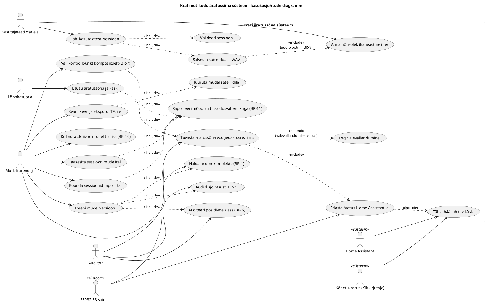

# Tehiste loomine — Krati süsteemi mudelartefaktid

## 1. Lähteülesande tõlgendus ja lünga selgitus

Viip nõuab artefakti genereerimist süsteemi kirjeldavatest algallikatest (UML-pildid, PlantUML-kood, vabas vormis tekst). Käesoleva lõputöö juurde ei ole talletatud ametlikke UML-skeeme ega PlantUML-faile; süsteemi kirjeldus on jaotunud peatükkidesse `introduction.tex`, `first_chapter.tex` (metoodika), `second_chapter.tex` (arutelu), `summary.tex`, `ylesandepystitus.tex` ning lühidalt eesti- ja ingliskeelsesse annotatsiooni. Algallika roll täidetakse seetõttu vabatekstilisest süsteemikirjeldusest, mis katab tegutsejad (kasutaja, ESP32-S3 satelliit, Home Assistant, mudeli arendaja, audiitor), äratussõna tuvastuse toru, andmeliigid ja hindamiskihid.

Kuna sisend on vabatekstiline, on tuletatud kaks vastastikku täiendavat artefakti:

1. süsteemi ärireeglid ja eesmärgid lausenditena (Stsenaarium A — tekstiline mudel),
2. kasutusjuhtude diagramm PlantUML-koodina (Stsenaarium B), mis koondab vabatekstis hajutatud kasutusjuhtumid üheks visuaalseks ülevaateks,
3. lisaks kasutusjuhtude samm-sammuline lühivorm, et siduda diagrammi tegevused olemasolevate metoodikakirjeldustega.

Kõik nimetused ja sildid on eestikeelsed ja kooskõlas lõputöö olemasolevate terminitega (näiteks äratussõna, valevallandumine, taustaheli, kõrvalejäetud komplekt, FAPH, voogedastushindamine, kasutajatest).

## 2. Tegutsejad ja olemid

**Inimtegutsejad:**

- **Lõppkasutaja** — nutikodu elanik, kes lausub fraasi „Kuule Kratt“ ja annab seejärel käsu (näiteks „pane valgus põlema“). Kasutaja roll lõputöös on määratletud kasutajatesti metoodikas (`first_chapter.tex`, §\ref{sec:user-test-methodology}).
- **Mudeli arendaja** — käesoleva töö autor, kes valmistab ette andmestiku, treenib mudeleid, käitab hindamise ja valib juurutuskandidaadi.
- **Audiitor / juhendaja** — isik, kes kontrollib treeningandmete ja hindamiskomplektide disjointsust ning hindamisprotokolli korrektsust. Töö on dokumenteerinud kolm valideerimisringi (`second_chapter.tex`, §\ref{sec:three-rounds}); audit on selles rollis kesksel kohal.
- **Kasutajatesti osaleja** — eraldi staatuses lõppkasutaja, kes annab nõusoleku andmete kogumiseks ning läbib kontrollitud sessiooni (viis äratussõna ütlust, viis sarnast negatiivfraasi, kuus skriptitud käsku, üks vabas vormis valgusülesanne).

**Tehnilised tegutsejad / välissüsteemid:**

- **ESP32-S3 satelliit** (Korvo-2 plaat ESPHome püsivaraga) — alati-aktiivne servaseade, mis töötleb mikrofoni helivoogu, hoiab kvantiseeritud TFLite-mudelit ja edastab äratuse Home Assistantile.
- **Home Assistant** — koduautomaatika platvorm, mis võtab `voice_assistant` liidese kaudu vastu äratuse, suunab heli edasiseks STT-ks ning täidab käsu.
- **Kõnetuvastusmoodul** (Kiirkirjutaja, töö skoobist väljas, kuid liideses esindatud) — STT-komponent, mis tõlgib käsu järgse heli tekstiks.
- **Treeningu- ja hindamistoru** (`microWakeWord`, TensorFlow Lite, valideerivad skriptid `kratt validate-user-test`, `kratt replay-user-test`, `kratt summarize-user-test`).
- **Andmekorpused** — Speech Commands (`marvin` kontrollkatse), MUSAN, VOiCES, Common Voice (sealhulgas eesti haru), kohalik „Kratt“ andmestik koos sünteetiliste laienditega.

**Olemid (info-objektid):**

- Äratussõna mudel (versioon, arhitektuur MixedNet, parameetriarv, kvantiseerimine, residuaalsete ühenduste lipp).
- Kontrollpunkt (kaalude hetk treeningu jooksul, valikukriteerium komposiitne).
- Hindamiskomplekt liigi järgi: `training`, `validation`, `testing`, `validation_ambient`, `testing_ambient`, kõrvalejäetud kasutajatesti komplekt.
- Mõõdiku kirje (FRR, FAPH variandiga: raamistiku, skriptitud taasmängu, välitingimuste, kasutajatesti taasmängu), koos 95% usaldusvahemikuga (Wilsoni või Poissoni-Garwoodi).
- Kasutajatesti rida (`trials.jsonl` kanne) ja vastav 16 kHz mono WAV-klipp.
- Nõusolekukirje (kaheastmeline: minimaalne, audio opt-in).
- Valevallandumise sündmus (ajatempel, kontekst, kasutatud lävi, mudeli versioon, mikrofon/seade).

## 3. Süsteemi eesmärgid

1. **Lokaalsus.** Kogu äratussõna tuvastus toimub kasutaja seadmes; pilveteenust ei kaasata. Kõnetuvastus jookseb sama kohaliku võrgu raames Home Assistanti hostis.
2. **Reprodutseeritavus.** Treeningu- ja hindamistoru on konfiguratsioonipõhine ning sõltumatult uuesti käivitatav. Kõik FAPH-numbrid on jälgitavad konkreetse FAPH-variandi loendusreeglini (`first_chapter.tex`, §\ref{subsec:faph-variants}).
3. **Tõendusdistsipliin.** Mudeli kvaliteet ei ole vastuvõetav enne, kui (a) treening- ja testkomplektide disjointsus on kontrollitud, (b) positiivse klassi sisuline audit on tehtud, (c) kontrollpunkti valikukriteerium on komposiitne (taustaheli FAPH + reaalsete kõnelejate tuvastamismäär + fraasistruktuuri test).
4. **Operatsionaalne usaldusväärsus.** Sihtväärtused: pidevvoo FAPH < 1 sõltumatul taustaheli korpusel ning lähikõne tuvastamismäär ≥ 0,95. Need on projekti-spetsiifilised, mitte universaalselt kehtestatud standardid.
5. **Ülekantavus väikese ressursiga keeltele.** Hindamisprotokoll on disainitud nii, et see oleks rakendatav teiste väikeste keelte äratussõna projektides.
6. **Privaatsuse austamine.** Nõusolekumudel on kaheastmeline; audio kogutakse ainult eraldi opt-iniga ning kasutajatesti heli on esmalt hindamis-, mitte treeningandmestik.

## 4. Ärireeglid (lausendid)

**BR-1 (andmestiku eraldatus).** Iga positiivne, negatiivne ja taustaheli klipp peab kuuluma täpselt ühte kogumist `training`, `validation`, `testing`, `validation_ambient`, `testing_ambient` või kasutajatesti kõrvalejäetud komplekti.

**BR-2 (disjointsuse audit).** Treeningule ei tohi sattuda ühtegi klippi, mis esineb mistahes hindamiskogumis. Vastasel juhul on tulemus mälukatse, mitte üldistuse mõõt (`second_chapter.tex`, §\ref{sec:data-leakage}).

**BR-3 (FAPH-variandi märge).** Iga raporteeritud FAPH-i väärtus peab kandma kasutatud variandi tähistust (raamistiku, skriptitud taasmängu, välitingimuste, kasutajatesti taasmängu). Variantide vahetut võrdlust tabelis ei lubata ilma vastava märkuseta.

**BR-4 (lävi valitakse ainult valideerimisel).** Otsustusläve kalibreerimine toimub `validation` ja `validation_ambient` peal. Testikomplekti pealt valitud lävi ei kõlba lõpparuandesse.

**BR-5 (mikrofoni sümmeetria).** Sama mikrofon peab esinema nii positiivses kui ka negatiivses klassis, et mudel ei õpiks mikrofoni signatuuri sihtfraasi tähistajana (lähtub kasutaja säilitatud meetodikareeglitest).

**BR-6 (kuule/kule mitmekesisus).** Treening- ja hindamiskomplekt peab katma nii „Kuule“ kui „Kule“ häälduse, vältimaks treeningu kallutatust ühe variandi suunas.

**BR-7 (kontrollpunkti komposiitne valik).** Juurutuskandidaadi kontrollpunkti valikul tuleb arvestada samaaegselt vähemalt kolme näitajat: sõltumatu taustaheli FAPH, reaalsete kõnelejate tuvastamismäär ja fraasistruktuuri eksimuse määr (prefiks, üksik sõna, pööratud järjekord, kuule/kule).

**BR-8 (kasutajatesti hindamis-rolli säilimine).** Kasutajatesti audio on hindamisandmestik. Seda ei lisata mudeli treeningusse enne, kui hindamine ja juurutuskandidaadi valik on lukustatud.

**BR-9 (nõusoleku kontroll).** Audiosalvestust säilitatakse ainult juhul, kui osaleja on andnud audio opt-in nõusoleku; muul juhul säilitatakse vaid pseudonüümsed tehnilised tulemused ja küsimustikuvastused.

**BR-10 (mudeli külmutamine kasutajatesti ajaks).** Aktiivne kasutajatestile esitatav mudel külmutatakse enne täismahus kogumist. Hilisem võrdlus mitme varimudeliga toimub identsete WAV-klippide taasesitusena, mitte uute ütlustega.

**BR-11 (mõõdikute usaldusvahemikud).** Klipi-tasandi proportsioonidele rakendatakse Wilsoni vahemikku, FAPH-ile Poissoni–Garwoodi vahemikku; sündmuste puudumisel raporteeritakse kolmereegli ühepoolne ülemine piir.

**BR-12 (resursipiirangud).** Juurutatav mudel koos `tensor_arena`-ga peab mahtuma ESP32-S3 mälupiiridesse; lõplik compile/flash kontroll tehakse aktiivse kasutajatesti konfiguratsiooni peal.

**BR-13 (ulatuse piirang).** Süsteem käsitleb ühte äratusfraasi „Kuule Kratt“. Kõnetuvastus, kõnesüntees ega kasutaja-spetsiifiline isikutuvastus ei kuulu lõputöö skoopi.

## 5. Kasutusjuhtude diagramm (PlantUML)

## 6. Kasutusjuhtude lühivormid

**UC_Lausu — Lausu äratussõna ja käsk**
1. Kasutaja lausub fraasi „Kuule Kratt“ tavalisel kõnetempol.
2. Satelliit töötleb 10 ms helikaadrid voogedastusrežiimis.
3. Kui mudel ületab kalibreeritud läve, käivitub UC_Tuvasta ja UC_Edasta.
4. Kasutaja ütleb käsu (näiteks „pane valgus põlema“).
5. Home Assistant edastab käsu STT-le ja täidab tegevuse (UC_Taida).
*Erivariant:* mudel ei vallandu — kasutaja lausub fraasi uuesti; kui kahe katse järel mitte vallandub, märgitakse väärtuvastamine.

**UC_Tuvasta — Äratussõna tuvastamine voogedastusrežiimis**
1. Mudel uuendab sisemist olekut iga uue spektrogrammikaadri saabumisel.
2. Väljundtõenäosus võrreldakse külmutatud lävega (BR-4).
3. Lävepiiri ületamisel käivitatakse UC_Edasta.
*Laiend:* valevallandumise korral logitakse sündmus (UC_LogiVV).

**UC_Sessioon — Kasutajatesti sessiooni läbiviimine**
1. Osaleja annab kaheastmelise nõusoleku (UC_Nousolek, BR-9).
2. Sessioonis lausutakse viis puhast äratusütlust, viis sarnast negatiivfraasi ning kuus skriptitud käsku.
3. Tööriist `kratt user-test` salvestab iga katse `trials.jsonl` ridana ja audio opt-in puhul vastava 16 kHz WAV-klipi (UC_Salvesta).
4. Vahetult pärast sessiooni käivitatakse `kratt validate-user-test` (UC_Valideeri).
5. Vigade puudumisel jääb sessioon hindamisandmestiku osaks (BR-8).

**UC_Taasesita — Sessiooni taasesitus mudelitel**
1. Arendaja käivitab `kratt replay-user-test` salvestatud WAV-failidega.
2. Iga mudel (näiteks v16c, expert-a, expert-b2, v6-residual, v10, v15, expert-a+expert-b2 konsensus) saab sama sisendi.
3. Tulemused koondatakse `kratt summarize-user-test` abil (UC_Koonda) ja raporteeritakse Wilsoni / Poissoni-Garwoodi usaldusvahemikega (UC_Raport, BR-11).

**UC_Audit — Disjointsuse audit**
1. Audiitor käivitab kontrollskripti, mis võrdleb iga hindamisklipi räsi treeninguklippide räsidega.
2. Mistahes kattuvuse korral märgitakse vastav hindamistulem kehtetuks ja parandus dokumenteeritakse (BR-2).

**UC_Kontrollpunkt — Kontrollpunkti komposiitne valik**
1. Treeningu jooksul salvestatakse kandidaat-kontrollpunktid.
2. Igale kandidaadile arvutatakse (i) sõltumatu taustaheli FAPH, (ii) reaalsete kõnelejate tuvastamismäär, (iii) fraasistruktuuri eksimuste määr.
3. Valitakse kontrollpunkt, mis ületab kõik kolm minimaalset kriteeriumi; kui ükski ei ületa, raporteeritakse ebaõnnestumine ja töötatakse andmestiku või arhitektuuri parandustega (BR-7).

**UC_LogiVV — Valevallandumise logimine**
1. Satelliit (või Androidi-põhine logija) salvestab valevallandumise ajatempli ja konteksti.
2. Heli säilitatakse ainult kasutaja vastava nõusoleku korral.
3. Logi suunatakse uuele iteratsioonile UC_HaldaAndmed kaudu, säilitades BR-1 ja BR-5 nõuded.

**UC_Juuruta — Mudeli juurutamine satelliidile**
1. Kvantiseeritud TFLite-mudel pakitakse ESPHome manifesti.
2. Kontrollitakse `tensor_arena` ja flashi mahtuvust (BR-12).
3. Mudel kompileeritakse ja paigaldatakse Korvo-2 plaadile.
4. Edukal käivitumisel saab mudelist potentsiaalne kasutajatesti aktiivne kandidaat (UC_Kulmuta).

## 7. Jälgitavus algallikate juurde

| Artefakti element | Algallikas |
|---|---|
| Tegutsejad ja rollid (kasutaja, ESP32-S3, Home Assistant, audiitor) | introduction.tex (lõik 1, lõik 5), first_chapter.tex (§\ref{sec:user-test-methodology}), ylesandepystitus.tex |
| Andmeliikide (BR-1) ja kogumite jaotus | first_chapter.tex (Andmeliigid, Tunnused ja andmevorming) |
| Disjointsuse nõue (BR-2), kolm valideerimisringi | second_chapter.tex (§\ref{sec:three-rounds}, §\ref{sec:data-leakage}) |
| FAPH-variandid (BR-3) ja loendusreegel | first_chapter.tex (§\ref{subsec:faph-variants}) |
| Lävi valideerimisel (BR-4) | first_chapter.tex (Hindamismõõdikud) |
| Mikrofoni sümmeetria (BR-5) | kasutaja meetodika-mälu (mic symmetry rule) |
| kuule/kule (BR-6) | kasutaja mälu (kule_vs_kuule_training_bias), second_chapter.tex (§\ref{sec:general-principle}) |
| Kontrollpunkti komposiitne valik (BR-7) | second_chapter.tex (§\ref{sec:three-rounds}, kolmas ring) |
| Kasutajatesti hindamis-roll (BR-8) | first_chapter.tex (§\ref{sec:user-test-methodology}) |
| Kaheastmeline nõusolek (BR-9) | first_chapter.tex (§\ref{sec:user-test-methodology}) |
| Aktiivse mudeli külmutamine (BR-10) | first_chapter.tex (§\ref{sec:user-test-methodology}) |
| Usaldusvahemikud (BR-11) | first_chapter.tex (Hindamismõõdikud) |
| ESP32-S3 mälunõuded (BR-12) | first_chapter.tex (§\ref{subsec:quantization}) |
| Skoobi piirang (BR-13) | introduction.tex (lõik 7), ylesandepystitus.tex (Töö piiritlemine) |

## 8. Heuristilised eeldused (lünga täitmise piirjäljed)

Järgmised elemendid ei ole algallikates eksplitsiitselt sõnastatud, kuid on lisatud süsteemianalüüsi parimate praktikate alusel ja jäävad valdkonnastandardi piiresse, ilma skoopi paisutamata:

- Audiitori roll on tuletatud sellest, et lõputöö dokumenteerib kolme valideerimisringi auditeid; eksplitsiitset isikut ei nimetata, kuid metoodika eeldab sõltumatut kontrolli.
- Kasutusjuht „Logi valevallandumine“ on lisatud, kuna kasutaja mälus ja töö praktikas on Androidi valevallandumiste logija olemas (`second_chapter.tex` viitab agentpõhise arendusega ehitatud Androidi rakendusele); see ei laienda skoopi, vaid kajastab juba kasutatavat tööriista.
- BR-12 (mahtuvuse kontroll) on lisatud, kuna `subsec:quantization` mainib lõpliku compile/flash kontrolli, kuid ei sõnasta seda reeglina.
- Kasutusjuhtude diagrammis on Home Assistant ja STT esitatud teisejärguliste süsteem-tegutsejatena, et säilitada peamine fookus äratussõna toru peal (BR-13).

## 9. Kvaliteedikontroll

- Diagramm on PlantUML-süntaksis, algab `@startuml` ja lõpeb `@enduml`. Kasutatud on toetatud konstruktsioone (`actor`, `usecase`, `rectangle`, `<<include>>`, `<<extend>>`, `left to right direction`).
- Nooled jooksevad tegutsejalt kasutusjuhuni; süsteem-tegutsejatel (Satelliit, HA, STT) on noolesuund samuti tegutsejalt funktsioonile, mis vastab UML-i kasutusjuhtude diagrammi konventsioonile.
- Nimetustes on kasutatud eestikeelseid omavorme: *kasutusjuht* (mitte *use case*), *olemid* (mitte *entiteedid*), *keskenduma* (mitte *fokusseerima*); termineid „voogedastusrežiim“, „äratussõna“, „valevallandumine“, „kõrvalejäetud komplekt“ kasutatakse järjekindlalt.
- Ärireeglid on sõnastatud lausenditena ja igaühel on selge jälg algallikani.
- Skoop ei ole paisutatud: lisatud on ainult need kasutusjuhud, mis on lõputöö metoodikas eksplitsiitselt nimetatud või vahetult eeldatud.
